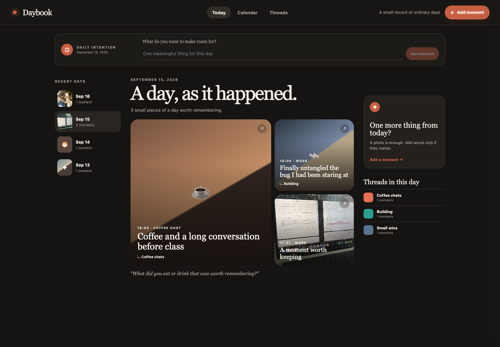
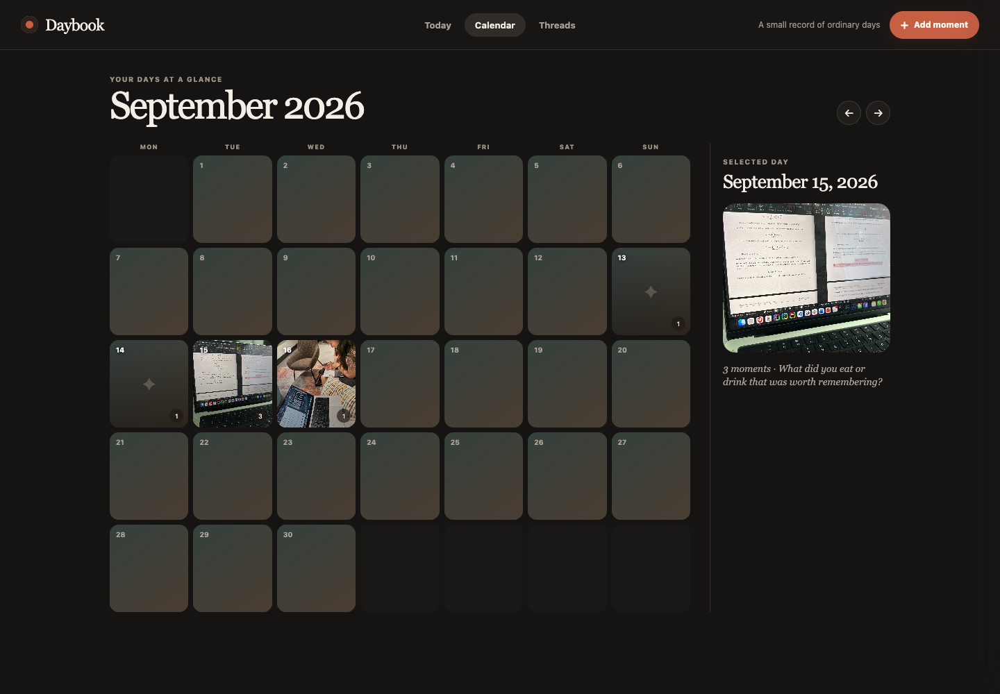
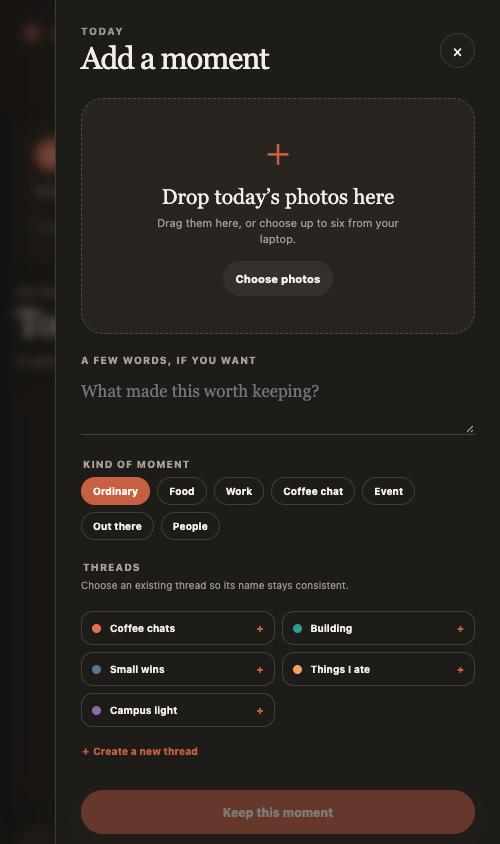

# Daybook

**Author:** Bhavye Mathur

**UMID:** 97660744

Daybook is a private, photo-first personal planner and record of everyday life.
It pairs one lightweight daily intention with the moments that actually made up
the day: work, food, coffee chats, events, people, and ordinary details. Moments
can belong to reusable **threads** such as `Coffee chats`, `Research`, or
`Campus light`, creating stories that continue across otherwise separate days.

## Daybook in action

The screenshots below come from the running app with representative moments and
photos. They show the same shared journal from three useful perspectives.



<table>
  <tr>
    <td width="70%"></td>
    <td width="30%"></td>
  </tr>
  <tr>
    <td><strong>Visual calendar.</strong> Photo-backed days make the archive scannable, while the selected-day panel gives immediate context.</td>
    <td><strong>Focused capture.</strong> Add photos, a caption, a moment kind, and reusable threads without leaving the flow.</td>
  </tr>
</table>

## Main features

- Plan one meaningful intention for any day, then complete, reopen, or remove it.
- Capture text-only or photo moments and classify them by kind.
- Reuse thread chips instead of retyping names; case-insensitive deduplication
  keeps the archive consistent.
- Browse a polished web timeline, photo calendar, and interactive thread
  gallery; open and safely delete individual moments.
- Capture from the native camera or photo library on mobile and receive one
  local 8 PM reminder each day.
- Plan, complete, review, and log from the terminal without opening a browser.
- Keep all four interfaces on one persistent Jac graph and photo store.

## How the four components fit together

| Component | Role |
| --- | --- |
| `core/journal.jac` | Server-side planning logic, graph persistence, photo storage, ownership checks, calendar aggregation, and typed public API. |
| `web/` | Full archive and planning workspace: daily story, intention control, calendar, threads, multi-photo upload, details, and deletion. |
| `mobile/` | Quick daily workflow: intention, camera/library capture, thread selection, recent moments, deletion, and reminder scheduling. |
| `cli/` | Fast terminal workflow for setting/completing intentions, logging moments, and reviewing days or threads. |

The `web`, `mobile`, and `cli` apps call the same public functions in
`core/journal.jac`. Days, intentions, moments, and threads are persistent graph
nodes reachable from the user's Jac root. Original photo bytes are stored under
`uploads/` while graph nodes retain storage metadata; both web and mobile load
photos through an ownership-checked API. `uploads/` is ignored by Git so
personal photos are never part of the submission repository.

## Why this project stands out

Daybook treats planning and memory as one coherent workflow instead of making
another generic task list. A daily intention records what the user meant to do;
the photo story records what the day became. Its four clients are not separate
demos: they share typed models, durable state, thread normalization, validation,
photo access control, and deletion behavior. The web interface supports
multi-photo drag-and-drop and a visual calendar, while the native mobile client
adds camera capture and idempotent local reminder scheduling. The interface is
deliberately photo-led and responsive, with meaningful empty states, keyboard-
accessible controls, interactive cards, and confirmation before destructive
actions.

## Prerequisites and fresh-checkout setup

- macOS, Linux, or Windows with a terminal
- Jac `0.37.14` (the version pinned in `jac.toml`)
- Node.js/npm as required by Jac's web and mobile toolchains
- Expo Go, Xcode, or Android Studio only for native mobile testing

Install Jac if needed:

```bash
curl -fsSL https://jaclang.org/install.sh | bash
```

Clone the submission and install its dependencies from the repository root:

```bash
git clone https://github.com/BhavyeMathur/eecs449-assignment1.git
cd eecs449-assignment1
jac install
```

If `jac` is not found after installation, add `$HOME/.local/bin` to your
`PATH` as prompted by the installer. Daybook requires no API keys or external
service configuration for local use; Jac provides the shared local persistence
layer.

## Run the web app and server

From the repository root:

```bash
jac run
```

The `web` app is configured as the default. Its dependency on the pinned
`server` module starts the shared backend automatically, so the grader only
needs this one command. Open the URL printed by Jac (normally
`http://localhost:8000`). For hot reload during development, use:

```bash
jac run --dev web
```

## Run the mobile app

For a quick browser preview of the responsive mobile interface:

```bash
jac run --dev --platform web mobile
```

Camera, photo-library, and notification APIs are native-only. To exercise them,
perform the one-time Expo setup and start the native development loop:

```bash
jac setup mobile
jac run --dev mobile
```

Press `i` for an iOS simulator, `a` for Android, or scan the Expo Go QR code.
The native app asks for camera/photo-library permission only when a capture is
requested. It asks for notification permission on first launch and schedules a
single daily 8 PM reminder, reusing the existing Daybook reminder on later
launches.

The mobile client uses the same server API and graph data as the web app and
CLI. The browser preview is useful for checking layout and ordinary interactions;
camera, library, and notification permissions must be tested natively.

## Use the CLI

Keep `jac run` running in one terminal. In a second terminal, from the same
repository root, point the CLI at the shared service:

```bash
export JAC_APP_SERVER_URL=http://localhost:8001/api/server

jac run cli -- plan "Finish the project review"
jac run cli -- log "Debugged the compiler" --kind work --thread Research --thread "Small wins"
jac run cli -- today
jac run cli -- done
jac run cli -- threads
jac run cli -- clear-plan
```

Every command also accepts `--date YYYY-MM-DD` where it is useful. `--thread`
is repeatable, avoiding a fragile comma-separated list.

## Validate the project

Run the same checks used before submission:

```bash
jac check
jac test
jac test core/journal.jac
jac build web
jac build --platform web mobile
```

The automated suite covers thread normalization, date/calendar behavior,
planning lifecycle, photo retrieval and deletion, orphan cleanup, and CLI
argument contracts. Native camera and notification behavior must additionally
be checked on an iOS or Android simulator/device because a browser cannot
validate OS-level permissions or scheduled notifications.

## Suggested grading walkthrough

1. Run `jac run` and open `http://localhost:8000`.
2. Set a daily intention, add a text or photo moment, and attach an existing or
   new thread.
3. Browse the same data through **Today**, **Calendar**, and **Threads**, then
   open a moment to view or delete it.
4. Keep the server running and use the CLI commands above to add or complete a
   plan; refresh the web view to see the shared state.
5. Launch the mobile preview or native app and confirm that it reads and writes
   the same Daybook.
